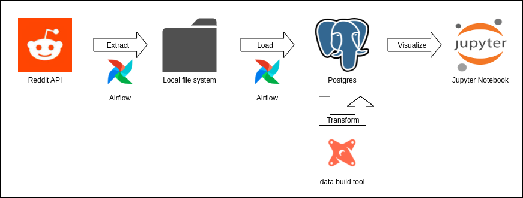

## Reddit Scrap

This is a sample ELT pipeline which uses several tools to load data from the Reddit API into a local database and create a basic dashboard from it. Per default, the pipeline is configured to fetch the Top 50 posts from the /r/popular subreddit every five minutes. The general data flow is the following:

1. Send requests to the Reddit API
2. Save the data obtained by the Reddit API to the local file system
3. Use a bulk import to load the data from the local file system into a Postgres Database
4. Execute transformations of the data in Postgres using the data build tool (dbt)
5. Manually create basic dashboard-ish plots with Jupyter Notebook

Steps 1-4 are orchestrated by a highly configurable Airflow DAG. This DAG could easily be switched to obtain data from other subreddits, fetch more posts per run and so on. To make this more scalable one could switch Postgres with a cloud-based Data Warehouse like AWS Redshift, GCP BigQuery and the local filesystem with the respective cloud-based storage solution. The fifth step has to be done manually and only symbolizes the use of more sophisticated solutions like Tableau or Looker.
